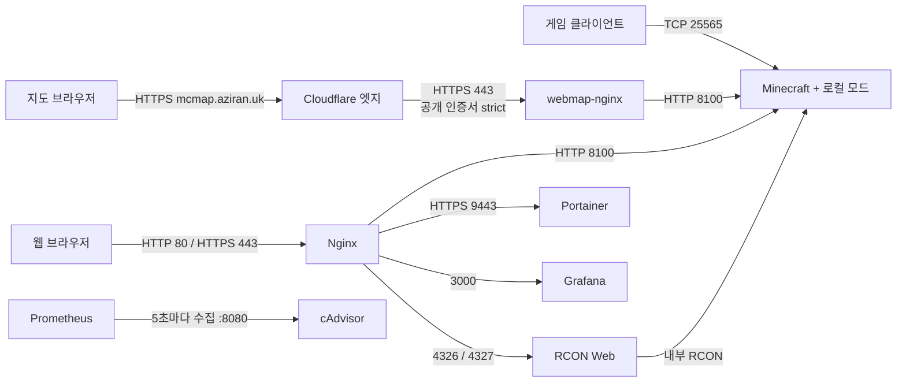

# 프로젝트 지도

2026-09-22에 저장소 설정과 로컬 파일 목록을 확인한 결과입니다. 실행 중인 서비스의 정상 동작을 보증하는 문서가 아닙니다. 기능 변경 시 해당 절과 검증 기준을 함께 갱신합니다.

## 현재 활성 서비스와 안내 웹사이트

Compose에서 실행 중인 서비스는 Minecraft, 내부 웹 RCON, 지도 HTTPS 원본 `webmap-nginx`다. Portainer·Grafana·Prometheus·cAdvisor·Nginx 정의는 주석으로 보존한다. 아래 관리 서비스·Nginx 구조 설명은 복원 가능한 기존 구성의 기록이며 현재 실행 상태를 뜻하지 않는다. Chunky 무인 프리젠 사이드카는 아래 Chunky 절을 참고한다.

웹 지도는 BlueMap `5.27-neoforge` JAR을 운영 서버에 설치했다(2026-09-24, 오프라인 백업 확인 후). BlueMap은 Compose 네트워크의 `http://minecraft:8100`에서 HTTP 200으로 응답하며 렌더링이 진행 중이다. `8100`은 호스트에 게시하지 않는다. 공개 경로는 Cloudflare 프록시 `A` 레코드 `mcmap` → 호스트 `443`의 `webmap-nginx`(Let's Encrypt `mcmap.aziran.uk` 인증서, `nginx/webmap.conf`) → `http://minecraft:8100`이다. 2026-09-24 `mcmap` DNS 레코드를 만들고 공개 HTTPS 200을 확인했다. 원본 인증서는 2026-12-23 만료이며 자동 갱신이 없어 수동 DNS-01 갱신이 필요하다. 이전 Cloudflare Tunnel 계획은 터널 생성 API 인증 오류로 폐기했다. 남은 절차는 [BlueMap 배포 안내](BLUEMAP.md)를 따른다. 주석 처리된 기존 Nginx는 복원하지 않는다. 옛 Dynmap `8123` 경로는 1.21 서버의 기록이며 26.3 구성에서 제거했다.

`https://aziran.uk`의 접속 안내는 `site/`의 정적 페이지를 GitHub Pages로 배포한다. 게임 접속은 `mc.aziran.uk:25565`를 통해 Minecraft 컨테이너로 직접 연결한다. 사이트 배포 워크플로는 `.github/workflows/pages.yml`, 안내 테스트는 `tests/test_join_guide.py`다. 다운로드는 GitHub 사전 릴리스 [`client-1.1.5`](https://github.com/aziran07/AziranMinecraftServer/releases/tag/client-1.1.5)를 가리킨다(실험 단계 Iris 때문에 사전 릴리스로 공개했다. 새 버전은 Release 생성 후 사이트를 배포한다). 이전 버전 `client-1.1.4` 사전 릴리스는 그대로 둔다. 상세 운영 절차는 [웹사이트 운영 안내](JOIN_GUIDE.md)를 참고한다.

## 26.3 준비 변경

현재 브랜치의 Minecraft 구성은 Java 25, Minecraft 26.3, NeoForge `26.3.0.8-beta`와 `server-data-26.3-neoforge/`를 사용하도록 준비한다. 26.3 계열 NeoForge는 베타 채널만 배포되므로 Compose의 `NEOFORGE_VERSION`에 정확한 버전을 고정한다. 고정 모드 목록은 `mods-26.3.lock.json`, 설치 및 검증 상태는 [모드 설치 안내](MODS_26_3.md), 로더 결정 근거는 [로더 비교](LOADER_COMPARISON_26_3.md)에 기록한다.

| 구성 | 데이터 경로 | 고정 목록 | 상태 |
| --- | --- | --- | --- |
| 1.21 Fabric | `server-data/` | 없음 | 백업 후 보존. 이번 작업에서 수정하지 않음 |
| 26.3 Fabric 준비 | `server-data-26.3/` | `mods-26.3-fabric-historical.lock.json` | 사용하지 않는 이전 결정. 파일만 보존 |
| 26.3 NeoForge | `server-data-26.3-neoforge/` | `mods-26.3.lock.json` | 현재 Compose가 사용하는 구성 |

아래 표의 1.21 구성과 로컬 모드 탐색 내용은 보존된 기존 서버에 대한 조사 기록이다. 현재 `mc_backup.sh`는 26.3 NeoForge의 `world/`를 대상으로 한다([월드 백업 안내](BACKUPS.md)).

## 범위와 구조

Docker Compose 운영 저장소이며 활성 서비스 4개(`minecraft`, `chunky-idle-pregen`, `webmap-nginx`, `rcon`)와 주석 처리된 서비스 5개의 정의를 둡니다. 클라이언트 팩 빌더와 검증 테스트, 정적 접속 안내 웹사이트 및 배포 워크플로도 관리합니다.

```text
docker-compose.yml               서비스·이미지·환경변수·볼륨·네트워크
nginx/webmap.conf                 지도 HTTPS 원본(webmap-nginx) server 블록
nginx/Dockerfile                  프록시 이미지와 인증서 복사(비활성 Nginx)
nginx/nginx.conf                  HTTP/stream 진입점과 로그
nginx/templates/
  default.conf.template          HTTP(S) 도메인과 WebSocket 라우팅
  minecraft.conf.template        게임 TCP 라우팅(비활성 Nginx)
prometheus.yml                   cAdvisor 수집 주기와 대상
mc_backup.sh                     월드 tar 백업과 오래된 파일 삭제
.gitignore                       비밀정보·운영 데이터 제외
AGENTS.md                        역할·Orca 협업·검증 규칙
CLAUDE.md                        Claude 작업 진입점
```

## 기능별 구현 위치

| 기능 | 구현·설정 위치 | 현재 선언된 동작 |
| --- | --- | --- |
| Minecraft 서버 | `docker-compose.yml` → `services.minecraft` | `itzg/minecraft-server:java25-alpine`, Minecraft `26.3`, `NEOFORGE`, `NEOFORGE_VERSION=26.3.0.8-beta`, 초기 메모리 `4G`, 최대 `20G` |
| 게임 기본 정책 | 같은 서비스의 `environment` | 난이도 `hard`, 비행 허용, 업적 알림, EULA 동의, `Asia/Seoul` |
| 월드·모드 저장 | 같은 서비스의 `volumes` | 호스트 `./server-data-26.3-neoforge` → 컨테이너 `/data`; 설치 모드는 `mods-26.3.lock.json`, 기존 데이터는 아래 로컬 데이터 절 참고 |
| 게임 TCP 접속 | `services.minecraft.ports` | 호스트 `25565` → 컨테이너 `aziran-minecraft-26-3:25565` 직접 게시. Nginx는 더 이상 `25565`를 게시하지 않으므로 `minecraft.conf.template`의 게임 stream은 현재 경로에서 사용되지 않습니다 |
| 웹 지도 | `services.minecraft.expose`, `mods-26.3.lock.json`의 BlueMap, [BLUEMAP.md](BLUEMAP.md); 배포 후 `server-data-26.3-neoforge/config/bluemap/`·`bluemap/` | BlueMap 내장 웹서버 `8100`을 Compose 네트워크에만 연다(호스트 미게시). JAR 설치됨(2026-09-24), 내부 HTTP 200·렌더링 진행 중 |
| 지도 HTTPS 공개 | `services.webmap-nginx`, `nginx/webmap.conf`, `nginx/cert.pem`·`key.pem`(Git 제외), Cloudflare DNS의 `mcmap` 프록시 `A` | `nginx:1.30-alpine`(다이제스트 고정)이 호스트 `443`만 게시하고 `mcmap.aziran.uk` SNI만 받아 Let's Encrypt 인증서로 TLS 종료 후 `http://minecraft:8100`으로 프록시. 다른 SNI는 핸드셰이크 거절. 설정·인증서는 읽기 전용 마운트. 공개 HTTPS 확인됨(2026-09-24). 인증서 2026-12-23 만료, 수동 갱신(docs/BLUEMAP.md) |
| RCON 활성화 | `services.minecraft.environment` | RCON 활성화와 `${RCON_PASSWORD}` 전달 |
| 웹 RCON 관리 | `services.rcon`, `default.conf.template` | `itzg/rcon`, 웹 `4326`, WebSocket `4327`, Minecraft에 내부 연결 |
| Docker 관리 UI | `services.portainer`, `default.conf.template` | Portainer HTTPS `9443`; 호스트 Docker socket 마운트로 Docker 접근 |
| 컨테이너 지표 | `services.cadvisor` | 호스트 시스템 경로를 읽기 전용 마운트; Prometheus의 수집 대상 |
| 시계열 수집·저장 | `services.prometheus`, `prometheus.yml` | 전역 15초, `cAdvisor` job은 `cadvisor:8080`을 5초마다 수집 |
| 지표 시각화 | `services.grafana`, `default.conf.template` | Grafana `3000`; 대시보드·데이터 소스 프로비저닝은 저장소에 없음 |
| TLS·리버스 프록시 | `nginx/Dockerfile`, `nginx/nginx.conf`, `default.conf.template` | Nginx `1.24.0-alpine`, 인증서 이미지 복사, HTTP/stream 분리, 공통 WebSocket 헤더 |
| 접근 로그 | `nginx/nginx.conf`, `services.nginx.volumes` | `nginx/logs/`에 HTTP·Minecraft stream 접근 로그와 오류 로그 저장 |
| 월드 백업 | `mc_backup.sh`, 사용자 crontab, [BACKUPS.md](BACKUPS.md) | 매시 30분 `server-data-26.3-neoforge/world/`를 저장 동기화 후 `minecraft_backups/26.3-world-*.tar`로 보관. 성공 뒤 710분 초과 정기 백업만 삭제 |

## 요청 흐름과 도메인

모든 서비스는 Compose의 `aziran-mc-network` bridge 네트워크를 사용합니다. 현재 호스트에 포트를 게시하는 서비스는 Minecraft(게임 `25565`)와 `webmap-nginx`(지도 HTTPS `443`)입니다. 지도는 Cloudflare 엣지가 프록시 `A` 레코드로 서버 `443`에 연결하며, `mcmap` DNS 레코드와 공개 HTTPS 200을 확인했습니다(2026-09-24). 호스트 `80`·`3733`은 이 저장소와 무관한 다른 Nginx가 쓰므로 비활성 Nginx(`80`·`443`)는 그대로 복원할 수 없습니다. 나머지 서비스의 `expose`는 호스트 포트 게시가 아닙니다.



Grafana와 Prometheus의 데이터 소스 연결은 추적된 설정에 없으므로 위 흐름에서 확정하지 않았습니다.

| 도메인 | HTTP :80 | HTTPS :443 대상 |
| --- | --- | --- |
| `mcmap.aziran.uk` | 지도 프록시 | `http://minecraft:8100` |
| `www.aziran.uk`, `aziran.uk` | HTTPS 리다이렉트 | `http://minecraft:8100` |
| `grafana.aziran.uk` | HTTPS 리다이렉트 | `http://grafana:3000` |
| `portainer.aziran.uk` | HTTPS 리다이렉트 | `https://portainer:9443` |
| `minecraft-rcon.aziran.uk` | HTTPS 리다이렉트 | `/` → `http://rcon:4326`, `/websocket-req` → `http://rcon:4327` |

Nginx 도메인 표는 비활성 구성을 복원할 때의 경로입니다. `mcmap.aziran.uk`는 비활성 Nginx가 아니라 별도 `webmap-nginx`(`nginx/webmap.conf`)가 처리합니다. 비활성 Nginx를 복원한다면 호스트 `443`과 `mcmap` server 블록이 `webmap-nginx`와 겹치지 않게 다시 정해야 합니다. 지도 프록시는 Compose 네트워크의 `minecraft:8100`(BlueMap)으로 바로 보내며, 옛 Dynmap용 `8123` stream listener는 제거했습니다. `www.aziran.uk`/`aziran.uk`는 현재 GitHub Pages 안내 사이트이므로 Nginx 복원 전에 이 server 블록을 다시 정해야 합니다. DNS 설정과 인증서 발급·갱신 자동화는 저장소에 없습니다. `webmap-nginx` 인증서의 수동 갱신 절차는 [BlueMap 배포 안내](BLUEMAP.md#수동-갱신-만료-30일-전-2026-11-23-무렵까지)에 있습니다.

## 환경변수와 로컬 의존성

`.env` 값은 읽거나 문서에 복사하지 않았습니다. 다음은 Compose가 참조하는 변수 이름과 용도입니다.

| 변수 | 사용처 |
| --- | --- |
| `RCON_PASSWORD` | Minecraft RCON 암호와 웹 RCON의 서버 접속 암호 |
| `ADMIN_NAME` | 웹 RCON 사용자 이름 |
| `ADMIN_PASSWORD` | 웹 RCON 로그인 암호 |
| `WSS_URL` | `RWA_WEBSOCKET_URL_SSL` |
| `WS_URL` | `RWA_WEBSOCKET_URL` |

`CF_API_KEY`와 `CURSEFORGE_FILES`는 주석 안에만 있습니다. 해당 모드 자동 설치 설정은 활성화되어 있지 않습니다. 변수에는 누락 검증이 없습니다. `docker compose config`(인자 없음)는 암호를 평문 출력하므로 `--quiet`로만 검사합니다. `config --quiet` 성공만으로 값의 적합성을 판정하지 않습니다.

| 로컬 경로 | 역할·주의 |
| --- | --- |
| `.env` | 자격 증명과 배포별 URL; Git 제외 |
| `nginx/cert.pem`, `nginx/key.pem` | Let's Encrypt 인증서 fullchain(`mcmap.aziran.uk`, 2026-12-23 만료, 수동 DNS-01 갱신)과 키; Git 제외. certbot 상태는 `~/.config/letsencrypt` 등 저장소 밖. `webmap-nginx`가 읽기 전용으로 마운트한다. 두 파일 `600`, 교체는 `cp` 덮어쓰기(파일 단위 마운트). 비활성 Nginx의 Dockerfile은 이미지에 복사하므로 그 이미지를 공유하지 않는다 |
| `server-data/` | 기존 1.21 Minecraft 영속 데이터; Git 제외 |
| `server-data-26.3/` | 26.3 Fabric 준비 당시 설치한 모드; 보존용, Git 제외 |
| `server-data-26.3-neoforge/` | 현재 Compose가 사용하는 26.3 NeoForge 데이터 경로; Git 제외 |
| `grafana-data/` | Grafana DB·설정 등 영속 데이터; Git 제외 |
| `prometheus-data/` | Prometheus 시계열 데이터; Git 제외 |
| `portainer-data/` | Portainer 관리 데이터; Git 제외 |
| `minecraft_backups/` | 26.3 월드 tar와 cron 실행 로그; Git 제외. 보호 일회성 백업은 별도 경로에 보관 |
| `nginx/logs/` | Nginx 로그; Git 제외 |

별도 worktree나 새 clone에는 이 파일들이 제공되지 않습니다. 특히 백업 스크립트의 기본 경로는 `/home/pilon1945/AziranMinecraftServer`이므로 다른 worktree에서 기본값으로 실행해도 기존 운영 경로를 대상으로 합니다. 테스트는 환경 변수로 임시 경로를 주입합니다.

## 로컬 게임 기능 탐색 지도

아래는 로컬 JAR·디렉터리 이름으로 파악한 탐색 위치입니다. 모드의 실제 로드 여부, 상세 기능, 설정의 적용 우선순위는 확인하지 않았습니다. 이 목록은 설치 명세나 복원 가능한 lockfile이 아닙니다.

| 영역 | 발견된 주요 모드 | 관련 탐색 위치 |
| --- | --- | --- |
| 지도 | Dynmap `3.7-beta-6` (1.21 기록. 26.3은 BlueMap) | `server-data/dynmap/`; 옛 `8123` 경로는 제거됨 |
| 팀·청크·편의 명령 | FTB Teams, FTB Chunks, FTB Essentials | `server-data/world/ftbteams/`, `world/ftbchunks/`, `world/ftbessentials/`, `world/serverconfig/`, `defaultconfigs/`, `config/ftbessentials.snbt` |
| 지형·구조물·차원 | Terralith, Structory, Structory Towers, Nullscape, The Bumblezone | `server-data/mods/`, `config/the_bumblezone.json`, `world/` |
| 기술·저장 | TechReborn, RebornCore, Tom's Storage, Compact Storage, Wider Ender Chests | `config/techreborn/`, `config/reborncore/`, `config/toms_storage.json` |
| 건축·농사 | Macaw's 시리즈, Handcrafted, Croptopia | `server-data/mods/`, `config/croptopia/` |
| 무덤 | Universal Graves (`graves` JAR) | `config/universal-graves/` |
| 성능·진단·청크 작업 | Lithium, Let Me Despawn, Clumps, Chunky, spark, Neruina, Packet Fixer, Carpet | `config/lithium.properties`, `config/letmedespawn.json`, `config/chunky/`, `config/spark/`, `config/neruina.json`, `config/packetfixer.properties` 등 |
| 표시·클라이언트 관련 파일 | Jade, JEI, Mod Menu, Sodium, Indium | `server-data/mods/`, `config/jade/`, `config/waila/`; 파일 존재가 서버 기능 활성화를 뜻하지 않음 |
| 공통 의존성 | Fabric API, Architectury, Cloth Config, FTB Library 등 | `server-data/mods/` |

표에서 `config/`, `world/`, `defaultconfigs/`로 시작하는 경로는 모두 `server-data/` 기준입니다. `server-data/server.properties`는 서버 속성 탐색 위치이며 자격 증명을 포함할 수 있습니다. `ops.json`, `whitelist.json`, 차단 목록, 플레이어 데이터도 운영 데이터입니다. 전체 내용을 출력하지 않습니다.

`config/yadclconfig.properties`, `config/exporter.properties` 파일은 있지만, 이름만으로 Discord 연동이나 Minecraft 지표 exporter가 활성화되었다고 판단하지 않습니다. Prometheus의 추적된 수집 대상은 cAdvisor 하나뿐입니다.

## 확인된 제약과 후속 작업 후보

아래 나머지 항목은 기존 설정의 관찰 결과입니다.

- **HTTP 리다이렉트 대상:** 여러 도메인을 하나의 server 블록에 넣고 `https://$server_name$request_uri`로 이동합니다. 요청 호스트 보존 여부를 도메인별로 검증할 후속 대상입니다. 해당 블록의 첫 선언 이름은 `www.aziran.uk`입니다.
- **백업 범위:** 정기 백업은 현재 서버의 `world/`만 포함합니다. 모드·서버 설정·BlueMap 렌더 데이터·관리 서비스 데이터까지 복구하는 전체 백업은 아닙니다. 같은 호스트의 `minecraft_backups/`에 두므로 호스트 장애 대비용 외부 백업도 아닙니다. 저장 동기화와 실패 처리, cron 일정, 복원 절차는 [BACKUPS.md](BACKUPS.md)에 기록합니다.
- **배포 재현성:** 여러 컨테이너 이미지가 버전 또는 digest로 고정되지 않았고 모드 설치 목록은 비활성 주석입니다. 로컬 데이터 없이 기존 서버 구성을 재현할 수 없습니다.
- **재시작 정책:** Minecraft·cAdvisor·Prometheus는 `always`, Portainer는 `unless-stopped`; RCON·Grafana·Nginx에는 명시된 정책이 없습니다. 헬스체크와 준비 완료 의존 관계도 정의되어 있지 않습니다.
- **구형 Compose 메타데이터:** `version: "3.9"`에 대해 현재 설치된 Compose는 obsolete 경고를 내지만 설정 검사는 통과합니다.

## 변경 작업과 수용 기준

| 작업 | 함께 검토할 영역 | 최소 검증·관찰 기준 |
| --- | --- | --- |
| 버전·메모리·모드 변경 | Compose Minecraft, `mods-26.3.lock.json`, 로컬 모드 호환성·월드 영향 | Compose 설정 검사; 각 JAR의 크기·해시·ZIP 무결성과 로더 메타데이터의 필수 의존성·버전 범위 대조; 합의된 실행 환경에서 서버 기동·모드 로드·게임 접속 확인 |
| 도메인·TLS·지도 경로 변경 | `services.webmap-nginx`, `nginx/webmap.conf`, Cloudflare DNS(`mcmap` 프록시 `A`)·SSL 모드, 두 템플릿, `nginx.conf`, Dockerfile, `expose`·게시 포트, `config/bluemap/webserver.conf` 포트 | `python3 -m unittest tests.test_bluemap_deployment -v`; `docker compose config --quiet`; `webmap-nginx`의 `nginx -t`; 도메인별 TLS·지도·게임 접속 확인. 배포 전 전체 백업은 [BACKUPS.md](BACKUPS.md), 지도 HTTP·렌더·HTTPS 검증은 [BLUEMAP.md](BLUEMAP.md) |
| 웹 RCON 변경 | Minecraft/RCON 환경변수, HTTP·WebSocket 경로 | 설정 검사; 실제 로그인·WebSocket 연결·허용된 조회 명령 확인 |
| 모니터링 변경 | cAdvisor, Prometheus, Grafana | 대상 버전의 `promtool check config`; 실제 scrape 상태·지표·대시보드 조회 확인 |
| 백업 변경 | 백업 스크립트, 저장·보존·복원 정책 | `bash -n`; 격리된 임시 데이터로 성공·실패·보존 경계·복원 결과 검증. 운영 백업 스크립트를 테스트 삼아 실행하지 않음 |
| 문서 변경 | README, 프로젝트 지도, 에이전트 진입점 | 상대 링크·파일 위치·설정 대응 확인, `git diff --check` |

일반 정적 검사:

```sh
docker compose config --quiet
bash -n mc_backup.sh
git diff --check
```

환경변수 치환 결과를 노출할 수 있는 `docker compose config` 전체 출력은 공유하지 않습니다. 운영 컨테이너 재시작, 포트 게시, 백업 삭제, 월드 변경은 단순 문서·정적 검증에 포함하지 않습니다.

### Codex → Claude 작업 전달

`AGENTS.md`의 Orca 절차를 따릅니다. Codex는 구현 전에 검증 방법을 정의하고 요구사항에 맞는 테스트를 작성합니다. 대상 기능·근거 파일, 원인·요구사항, 설계와 제외 범위, 수정 소유권, 관찰 가능한 수용 기준, 테스트와 검증 환경·명령, 데이터 보호 조건을 Claude에게 전달합니다. 테스트 파일의 소유권은 Codex에 둡니다.

Claude는 기능 구현과 테스트 실행·로컬 검증을 수행하고 결과를 Orca orchestration으로 반환합니다. 테스트 결함·누락이나 기대 결과 변경이 필요하면 근거를 Codex에게 보고하며 직접 테스트를 수정하지 않습니다. Codex는 실제 diff를 리뷰하고 필요한 테스트를 추가·수정한 뒤 독립 검증으로 완료를 판단합니다. 기능 구현 결함은 Claude에 돌려보내고 테스트 결함은 Codex가 수정합니다. 기대 동작 변경에는 설계상 근거가 필요하며 실패한 구현에 맞춰 테스트를 완화하지 않습니다.

Orca 명령은 이 문서에 고정하지 않습니다. 작업 시 설치된 `orca-cli`·`orchestration` 스킬과 버전이 맞는 CLI 가이드를 읽습니다. 문서·분석·테스트 코드와 테스트 전용 헬퍼·픽스처 작성·수정은 Codex가 직접 수행하며, 실제 기능 코드·운영 설정·운영 스크립트 수정은 Claude 구현 범위입니다.

## 이번 문서화의 검증 범위

- 추적된 구성 파일 전체와 `.gitignore`, 기존 `AGENTS.md`를 읽었습니다.
- 로컬 데이터는 디렉터리·파일 이름만 조사했습니다. 비밀정보·월드·관리 DB 내용은 조사하지 않았습니다.
- `docker compose config --quiet`: 성공, 상기 `version` obsolete 경고 발생.
- `bash -n mc_backup.sh`: 성공. 백업 실행·복원 성공을 의미하지 않습니다.
- 서비스 기동·이미지 빌드·Nginx 런타임 검사·실제 접속·모드 로드·백업 실행은 수행하지 않았습니다.

## 클라이언트 모드팩

`scripts/build_client_pack.py`는 서버 고정 목록과 `mods-26.3-client-extra.lock.json`을 읽어 클라이언트 모드 18개와 셰이더 팩 1개(팩 `1.1.5`)를 Modrinth `.mrpack`, 수동 설치 ZIP, MultiMC 인스턴스 ZIP 세 가지로 패키징한다. MultiMC ZIP의 로더 컴포넌트 UID는 MultiMC 공식 메타의 `net.neoforged`이며 Prism Launcher의 `net.neoforged.neoforge`와 다르다. 클라이언트 전용 JAR 캐시는 `client-mods-cache/`, 생성 파일은 `dist/`에 두며 둘 다 Git에서 제외한다. 생성된 목록은 `mods-26.3-client.lock.json`, 검증은 `python3 -m unittest discover -s tests -v`를 사용한다. 설치 안내는 [README](../README.md#클라이언트-모드팩), 선택 근거는 [호환성 검토](CLIENT_MOD_COMPATIBILITY_26_3.md)에 있다. 클라이언트 전용 모드(ImmediatelyFast, Mouse Tweaks, JourneyMap, Sodium, Iris)와 셰이더 팩은 서버에 설치하지 않으므로 이 빌드는 서버 구성·모드 디렉터리를 바꾸지 않는다. 재빌드는 이전 버전의 MultiMC 인스턴스 ZIP만 `gio trash`로 휴지통에 보내며(복구 가능, `gio` 없으면 빌드 중단), `.mrpack`과 수동 ZIP은 지우지 않는다.

입력 lock이 `bundle_jar=false`로 표시한 모드는 JAR을 산출물에 담지 않는다. `.mrpack`의 Modrinth CDN 다운로드 항목으로만 설치되고, 수동 ZIP·MultiMC ZIP·`manifest.json`에서는 빠진다. `1.1.4`·`1.1.5`에서는 JourneyMap과 입력 lock `shaderpacks`의 Complementary Reimagined가 여기에 해당한다. [JourneyMap 공식 라이선스](https://teamjm.github.io/journeymap-docs/6.0.x/about/licensing/)가 번들·재호스팅을 금지하고 설치·실행 중 CurseForge·Modrinth 다운로드만 허용하며, Complementary License Agreement 1.7의 1.2.d도 Modrinth·CurseForge 시스템으로만 모드팩에 넣도록 한다. 그래서 두 ZIP은 JAR 17개만 담고, 생성되는 `README.md`가 맨 앞에서 그 사실과 공식 배포처에서 직접 받아 넣는 절차를 안내하며 MultiMC 사용자에게 `.mrpack`을 권한다. `bundle_jar=false`인데 CDN URL이 없으면 설치 경로가 없으므로 빌드를 중단한다.

크래시 관찰 기록: 16개를 모두 켠 `1.1.2`는 Windows에서 `0xc0000005`로 크래시하며 `xaerominimap-neoforge-26.3-26.5.3.jar` 하나만 빼면 실행된다(A/B 확인). 그 조합에서의 방아쇠는 Xaero's Minimap이고 네이티브 실패 메커니즘은 규명하지 않았다. `1.1.3`은 그 모드를 JourneyMap으로 교체했으나 **Windows 실행·접속을 확인하지 않았다.** `1.1.3` 시점까지 실행과 서버 접속이 함께 확인된 유일한 구성은 Sodium을 꺼 둔 `1.1.0` 인스턴스였다.

`1.1.4` 추가 사항: Iris는 미병합 PR #3354 커밋 `10d3598cd96b0566497b66efe66256f468cd977e`의 로컬 빌드라 입력 lock의 `source: local-build`, `build`, `source_bundle`로 기록한다. 빌더는 `client-mods-cache/iris-source/`의 대응 소스·라이선스 파일을 lock의 크기·SHA-256과 대조한 뒤 세 아카이브의 `sources/iris/`(게임 디렉터리 밖)에 담는다. 또한 Occultism 26.3(커밋 `631457c`) `ClientSetupEventHandler.java` 218행이 사역마 단축키를 `Type.KEYBOARD, -1`로 등록해 두 번째 실행이 `InputConstants.isKeyDown`의 `IndexOutOfBoundsException`으로 실패하는 상류 결함을 우회하려고, `version:5023`과 사역마 단축키 18개를 `key.keyboard.unknown`으로 적은 최소 `options.txt`를 `.mrpack` `client-overrides/options.txt`, 수동 ZIP `options.txt`, MultiMC ZIP `.minecraft/options.txt`에 넣는다. 사역마 목록은 빌더의 `OCCULTISM_FAMILIARS`, 검증은 `tests/test_client_options.py`다. 이미 `options.txt`가 있는 인스턴스에는 적용되지 않을 수 있으므로 안내 문서가 수동 수정 절차를 설명한다. 사용자가 배포한 이 팩으로 새로 만든 인스턴스의 Windows 두 번 연속 실행 성공을 보고했다(그 두 실행의 서버 접속·셰이더 적용 여부는 보고에 없음).

`1.1.5` 추가 사항: 모드·셰이더 구성은 `1.1.4`와 같다. 빌더의 `render_servers_dat`가 멀티플레이 목록에 `SERVER_LIST_NAME`(`Aziran`)·`SERVER_LIST_ADDRESS`(`mc.aziran.uk`) 항목 하나만 적은 압축하지 않은 NBT `servers.dat`를 만들어 `.mrpack` `client-overrides/servers.dat`, 수동 ZIP `servers.dat`, MultiMC ZIP `.minecraft/servers.dat`에 넣고, lock의 `seeded_servers`에 기록한다. 새 인스턴스에만 적용되며 기존 인스턴스의 서버 목록은 바꾸지 않는다. 검증은 `tests/test_client_servers.py`다. `1.1.5` 아카이브로 새로 만든 인스턴스의 게임 실행은 확인하지 않았다.

## Chunky 무인 프리젠

`scripts/chunky_idle_controller.py`와 Compose 서비스 `chunky-idle-pregen`이 접속자 0명일 때만 네더 1000 → 오버월드 8000 → 엔드 8000 순으로 Chunky 프리젠을 진행한다. 작업 진행 중에는 1초(`--poll-interval`), 플레이어 때문에 pause됐거나 시작 대기 중에는 60초(`--idle-poll-interval`)마다 접속자를 확인하므로 재개는 퇴장 후 최대 약 60초 걸린다. 캠페인 동안 `minecraft` 서비스에 `PAUSE_WHEN_EMPTY_SECONDS=-1`을 둔다. 상태는 `chunky-idle-state/`(Git 제외), 검증은 `python3 -m unittest tests.test_chunky_idle_controller -v`. 배포는 PR 브랜치 `chunky-idle-pregen`을 체크아웃한 운영 폴더 `/home/pilon1945/AziranMinecraftServer`에서 일반 `docker compose` 명령으로 한다(스크립트는 `./scripts/`에서 읽기 전용 마운트, 별도 worktree·경로 변수 없음). 사이드카는 공식 `python:3.13-alpine` 이미지(사용자 `1000:1000`)로 실행하며 이 이미지에는 HEALTHCHECK가 없으므로 상태는 health가 아니라 exit 코드·재시작 횟수·로그로 본다. 동작·완료 판정·운영 절차는 [CHUNK_PREGEN.md](CHUNK_PREGEN.md#무인-프리젠-컨트롤러)에 있다.
