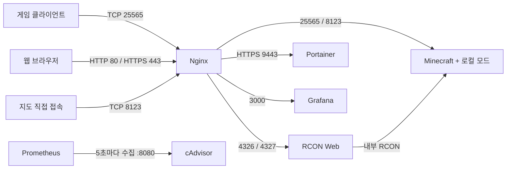

# 프로젝트 지도

2026-09-22에 저장소 설정과 로컬 파일 목록을 확인한 결과입니다. 실행 중인 서비스의 정상 동작을 보증하는 문서가 아닙니다. 기능 변경 시 해당 절과 검증 기준을 함께 갱신합니다.

## 범위와 구조

7개 서비스로 구성된 Docker Compose 운영 저장소입니다. 애플리케이션 소스, 자체 모드 소스, 패키지 빌드 설정, 자동화 테스트, CI 파이프라인은 현재 추적 파일에서 확인되지 않았습니다.

```text
docker-compose.yml               서비스·이미지·환경변수·볼륨·네트워크
nginx/Dockerfile                  프록시 이미지와 인증서 복사
nginx/nginx.conf                  HTTP/stream 진입점과 로그
nginx/templates/
  default.conf.template          HTTP(S) 도메인과 WebSocket 라우팅
  minecraft.conf.template        게임·지도 TCP 라우팅
prometheus.yml                   cAdvisor 수집 주기와 대상
mc_backup.sh                     월드 tar 백업과 오래된 파일 삭제
.gitignore                       비밀정보·운영 데이터 제외
AGENTS.md                        역할·Orca 협업·검증 규칙
CLAUDE.md                        Claude 작업 진입점
```

## 기능별 구현 위치

| 기능 | 구현·설정 위치 | 현재 선언된 동작 |
| --- | --- | --- |
| Minecraft 서버 | `docker-compose.yml` → `services.minecraft` | `itzg/minecraft-server:java21-alpine`, Minecraft `1.21`, `FABRIC`, 초기 메모리 `4G`, 최대 `20G` |
| 게임 기본 정책 | 같은 서비스의 `environment` | 난이도 `hard`, 비행 허용, 업적 알림, EULA 동의, `Asia/Seoul` |
| 월드·모드 저장 | 같은 서비스의 `volumes` | 호스트 `./server-data` → 컨테이너 `/data`; 상세 설정·게임 기능은 아래 로컬 데이터 절 참고 |
| 게임 TCP 접속 | `services.nginx.ports`, `nginx/templates/minecraft.conf.template` | 호스트 `25565` → Nginx stream → `minecraft:25565` |
| 웹 지도 | 두 Nginx 템플릿, 로컬 `server-data/mods/`·`server-data/dynmap/` | TCP `8123` → `minecraft:8123`; HTTP 도메인은 Nginx 내부 `localhost:8123` stream listener 경유 |
| RCON 활성화 | `services.minecraft.environment` | RCON 활성화와 `${RCON_PASSWORD}` 전달 |
| 웹 RCON 관리 | `services.rcon`, `default.conf.template` | `itzg/rcon`, 웹 `4326`, WebSocket `4327`, Minecraft에 내부 연결 |
| Docker 관리 UI | `services.portainer`, `default.conf.template` | Portainer HTTPS `9443`; 호스트 Docker socket 마운트로 Docker 접근 |
| 컨테이너 지표 | `services.cadvisor` | 호스트 시스템 경로를 읽기 전용 마운트; Prometheus의 수집 대상 |
| 시계열 수집·저장 | `services.prometheus`, `prometheus.yml` | 전역 15초, `cAdvisor` job은 `cadvisor:8080`을 5초마다 수집 |
| 지표 시각화 | `services.grafana`, `default.conf.template` | Grafana `3000`; 대시보드·데이터 소스 프로비저닝은 저장소에 없음 |
| TLS·리버스 프록시 | `nginx/Dockerfile`, `nginx/nginx.conf`, `default.conf.template` | Nginx `1.24.0-alpine`, 인증서 이미지 복사, HTTP/stream 분리, 공통 WebSocket 헤더 |
| 접근 로그 | `nginx/nginx.conf`, `services.nginx.volumes` | `nginx/logs/`에 HTTP·Minecraft stream 접근 로그와 오류 로그 저장 |
| 월드 백업 | `mc_backup.sh` | `server-data/world`를 시간 이름의 비압축 `.tar`로 저장하고 710분 초과 파일 삭제 |

## 요청 흐름과 도메인

모든 서비스는 Compose의 `aziran-mc-network` bridge 네트워크를 사용합니다. 호스트에 포트를 게시하는 서비스는 Nginx입니다. 나머지 서비스의 `expose`는 호스트 포트 게시가 아닙니다.



Grafana와 Prometheus의 데이터 소스 연결은 추적된 설정에 없으므로 위 흐름에서 확정하지 않았습니다.

| 도메인 | HTTP :80 | HTTPS :443 대상 |
| --- | --- | --- |
| `mcmap.aziran.uk` | 지도 프록시 | `http://localhost:8123` |
| `www.aziran.uk`, `aziran.uk` | HTTPS 리다이렉트 | `http://localhost:8123` |
| `grafana.aziran.uk` | HTTPS 리다이렉트 | `http://grafana:3000` |
| `portainer.aziran.uk` | HTTPS 리다이렉트 | `https://portainer:9443` |
| `minecraft-rcon.aziran.uk` | HTTPS 리다이렉트 | `/` → `http://rcon:4326`, `/websocket-req` → `http://rcon:4327` |

지도 프록시의 `localhost`는 Nginx 컨테이너 자신을 의미합니다. 동일 컨테이너의 stream 설정이 `8123`을 받아 Minecraft로 전달하므로, 이 설정을 바꿀 때 두 템플릿을 함께 확인합니다. DNS 설정과 인증서 발급·갱신 자동화는 저장소에 없습니다.

## 환경변수와 로컬 의존성

`.env` 값은 읽거나 문서에 복사하지 않았습니다. 다음은 Compose가 참조하는 변수 이름과 용도입니다.

| 변수 | 사용처 |
| --- | --- |
| `RCON_PASSWORD` | Minecraft RCON 암호와 웹 RCON의 서버 접속 암호 |
| `ADMIN_NAME` | 웹 RCON 사용자 이름 |
| `ADMIN_PASSWORD` | 웹 RCON 로그인 암호 |
| `WSS_URL` | `RWA_WEBSOCKET_URL_SSL` |
| `WS_URL` | `RWA_WEBSOCKET_URL` |

`CF_API_KEY`와 `CURSEFORGE_FILES`는 주석 안에만 있습니다. 해당 모드 자동 설치 설정은 활성화되어 있지 않습니다. Compose에는 필수 변수 누락을 즉시 차단하는 `${VAR:?…}` 검증이 없습니다. `config --quiet` 성공만으로 값의 적합성을 판정하지 않습니다.

| 로컬 경로 | 역할·주의 |
| --- | --- |
| `.env` | 자격 증명과 배포별 URL; Git 제외 |
| `nginx/cert.pem`, `nginx/key.pem` | Dockerfile의 필수 입력; Git 제외, 현 로컬에 파일 존재. 키는 이미지에 복사되므로 이미지 공유 범위에 주의 |
| `server-data/` | Minecraft 영속 데이터 전체; Git 제외 |
| `grafana-data/` | Grafana DB·설정 등 영속 데이터; Git 제외 |
| `prometheus-data/` | Prometheus 시계열 데이터; Git 제외 |
| `portainer-data/` | Portainer 관리 데이터; Git 제외 |
| `minecraft_backups/` | 월드 tar 백업; Git 제외 |
| `nginx/logs/` | Nginx 로그; Git 제외 |

별도 worktree나 새 clone에는 이 파일들이 제공되지 않습니다. 특히 백업 스크립트는 절대 경로 `/home/pilon1945/AziranMinecraftServer`를 사용하므로 다른 worktree에서 실행해도 기존 운영 경로를 대상으로 합니다.

## 로컬 게임 기능 탐색 지도

아래는 로컬 JAR·디렉터리 이름으로 파악한 탐색 위치입니다. 모드의 실제 로드 여부, 상세 기능, 설정의 적용 우선순위는 확인하지 않았습니다. 이 목록은 설치 명세나 복원 가능한 lockfile이 아닙니다.

| 영역 | 발견된 주요 모드 | 관련 탐색 위치 |
| --- | --- | --- |
| 지도 | Dynmap `3.7-beta-6` | `server-data/dynmap/`, Nginx의 `8123` 경로 |
| 팀·청크·편의 명령 | FTB Teams, FTB Chunks, FTB Essentials | `server-data/world/ftbteams/`, `world/ftbchunks/`, `world/ftbessentials/`, `world/serverconfig/`, `defaultconfigs/`, `config/ftbessentials.snbt` |
| 지형·구조물·차원 | Terralith, Structory, Structory Towers, Nullscape, The Bumblezone | `server-data/mods/`, `config/the_bumblezone.json`, `world/` |
| 기술·저장 | TechReborn, RebornCore, Tom's Storage, Compact Storage, Wider Ender Chests | `config/techreborn/`, `config/reborncore/`, `config/toms_storage.json` |
| 건축·농사 | Macaw's 시리즈, Handcrafted, Croptopia | `server-data/mods/`, `config/croptopia/` |
| 무덤 | Universal Graves (`graves` JAR) | `config/universal-graves/` |
| 성능·진단·청크 작업 | Lithium, Let Me Despawn, Clumps, Chunky, spark, Neruina, Packet Fixer, Carpet | `config/lithium.properties`, `config/letmedespawn.json`, `config/chunky/`, `config/spark/`, `config/neruina.json`, `config/packetfixer.properties` 등 |
| 표시·클라이언트 관련 파일 | Jade, JEI, Mod Menu, Sodium, Indium | `server-data/mods/`, `config/jade/`, `config/waila/`; 파일 존재가 서버 기능 활성화를 뜻하지 않음 |
| 공통 의존성 | Fabric API, Architectury, Cloth Config, FTB Library 등 | `server-data/mods/` |

표에서 `config/`, `world/`, `defaultconfigs/`로 시작하는 경로는 모두 `server-data/` 기준입니다. `server-data/server.properties`는 서버 속성 탐색 위치이며 자격 증명을 포함할 수 있습니다. `ops.json`, `whitelist.json`, 차단 목록, 플레이어 데이터도 운영 데이터입니다. 전체 내용을 출력하지 않습니다.

`config/yadclconfig.properties`, `config/exporter.properties` 파일은 있지만, 이름만으로 Discord 연동이나 Minecraft 지표 exporter가 활성화되었다고 판단하지 않습니다. Prometheus의 추적된 수집 대상은 cAdvisor 하나뿐입니다.

## 확인된 제약과 후속 작업 후보

이 절은 기존 설정의 관찰 결과이며 이번 문서화에서 수정하지 않았습니다.

- **HTTP 리다이렉트 대상:** 여러 도메인을 하나의 server 블록에 넣고 `https://$server_name$request_uri`로 이동합니다. 요청 호스트 보존 여부를 도메인별로 검증할 후속 대상입니다. 해당 블록의 첫 선언 이름은 `www.aziran.uk`입니다.
- **백업 실패 처리:** `cd`·`tar` 실패를 차단하는 처리 없이 삭제 명령까지 이어집니다. 최종 종료 코드가 백업 성공을 증명하지 않습니다.
- **백업 삭제 범위:** `find ./minecraft_backups/ -type f -mmin +710`은 tar 확장자로 제한하지 않으며 공백 안전한 파일명 전달도 사용하지 않습니다.
- **백업 정합성·복원 범위:** 실행 중 월드 저장과 동기화하는 단계가 없고 백업 범위는 `world/`뿐입니다. 모드·서버 설정·관리 서비스 데이터까지 복구하는 전체 백업은 아닙니다. 스케줄러·복원 절차는 추적 파일에 없습니다.
- **배포 재현성:** 여러 컨테이너 이미지가 버전 또는 digest로 고정되지 않았고 모드 설치 목록은 비활성 주석입니다. 로컬 데이터 없이 기존 서버 구성을 재현할 수 없습니다.
- **재시작 정책:** Minecraft·cAdvisor·Prometheus는 `always`, Portainer는 `unless-stopped`; RCON·Grafana·Nginx에는 명시된 정책이 없습니다. 헬스체크와 준비 완료 의존 관계도 정의되어 있지 않습니다.
- **구형 Compose 메타데이터:** `version: "3.9"`에 대해 현재 설치된 Compose는 obsolete 경고를 내지만 설정 검사는 통과합니다.

## 변경 작업과 수용 기준

| 작업 | 함께 검토할 영역 | 최소 검증·관찰 기준 |
| --- | --- | --- |
| 버전·메모리·모드 변경 | Compose Minecraft, 로컬 모드 호환성·월드 영향 | Compose 설정 검사; 합의된 실행 환경에서 서버 기동·모드 로드·게임 접속 확인 |
| 도메인·TLS·지도 경로 변경 | 두 템플릿, `nginx.conf`, Dockerfile, 게시 포트 | 실제 빌드 이미지의 `nginx -t`; 도메인별 리다이렉트·TLS·지도·게임 접속 확인 |
| 웹 RCON 변경 | Minecraft/RCON 환경변수, HTTP·WebSocket 경로 | 설정 검사; 실제 로그인·WebSocket 연결·허용된 조회 명령 확인 |
| 모니터링 변경 | cAdvisor, Prometheus, Grafana | 대상 버전의 `promtool check config`; 실제 scrape 상태·지표·대시보드 조회 확인 |
| 백업 변경 | 백업 스크립트, 저장·보존·복원 정책 | `bash -n`; 격리된 임시 데이터로 성공·실패·보존 경계·복원 결과 검증. 운영 백업 스크립트를 테스트 삼아 실행하지 않음 |
| 문서 변경 | README, 프로젝트 지도, 에이전트 진입점 | 상대 링크·파일 위치·설정 대응 확인, `git diff --check` |

일반 정적 검사:

```sh
docker compose config --quiet
bash -n mc_backup.sh
git diff --check
```

환경변수 치환 결과를 노출할 수 있는 `docker compose config` 전체 출력은 공유하지 않습니다. 운영 컨테이너 재시작, 포트 게시, 백업 삭제, 월드 변경은 단순 문서·정적 검증에 포함하지 않습니다.

### Codex → Claude 작업 전달

`AGENTS.md`의 Orca 절차를 따릅니다. Codex는 구현 전에 검증 방법을 정의하고 요구사항에 맞는 테스트를 작성합니다. 대상 기능·근거 파일, 원인·요구사항, 설계와 제외 범위, 수정 소유권, 관찰 가능한 수용 기준, 테스트와 검증 환경·명령, 데이터 보호 조건을 Claude에게 전달합니다. 테스트 파일의 소유권은 Codex에 둡니다.

Claude는 기능 구현과 테스트 실행·로컬 검증을 수행하고 결과를 Orca orchestration으로 반환합니다. 테스트 결함·누락이나 기대 결과 변경이 필요하면 근거를 Codex에게 보고하며 직접 테스트를 수정하지 않습니다. Codex는 실제 diff를 리뷰하고 필요한 테스트를 추가·수정한 뒤 독립 검증으로 완료를 판단합니다. 기능 구현 결함은 Claude에 돌려보내고 테스트 결함은 Codex가 수정합니다. 기대 동작 변경에는 설계상 근거가 필요하며 실패한 구현에 맞춰 테스트를 완화하지 않습니다.

Orca 명령은 이 문서에 고정하지 않습니다. 작업 시 설치된 `orca-cli`·`orchestration` 스킬과 버전이 맞는 CLI 가이드를 읽습니다. 문서·분석·테스트 코드와 테스트 전용 헬퍼·픽스처 작성·수정은 Codex가 직접 수행하며, 실제 기능 코드·운영 설정·운영 스크립트 수정은 Claude 구현 범위입니다.

## 이번 문서화의 검증 범위

- 추적된 구성 파일 전체와 `.gitignore`, 기존 `AGENTS.md`를 읽었습니다.
- 로컬 데이터는 디렉터리·파일 이름만 조사했습니다. 비밀정보·월드·관리 DB 내용은 조사하지 않았습니다.
- `docker compose config --quiet`: 성공, 상기 `version` obsolete 경고 발생.
- `bash -n mc_backup.sh`: 성공. 백업 실행·복원 성공을 의미하지 않습니다.
- 서비스 기동·이미지 빌드·Nginx 런타임 검사·실제 접속·모드 로드·백업 실행은 수행하지 않았습니다.
